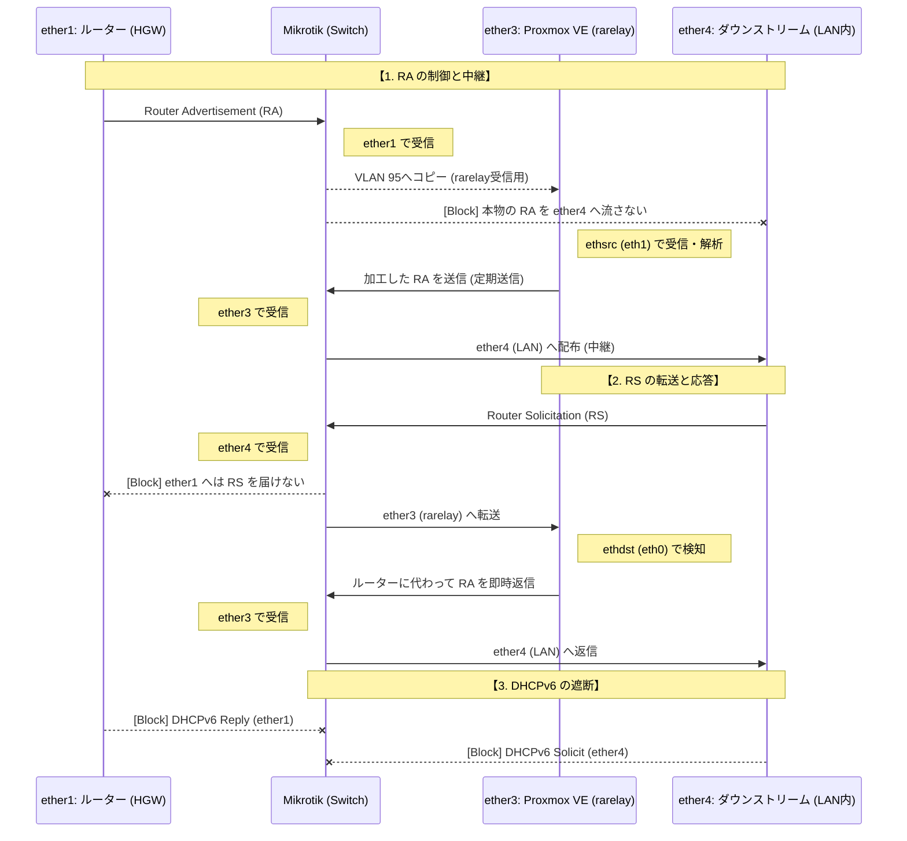

# Mikrotik CRS304-4XG を使用したネットワーク構成例

Mikrotik CRS304-4XG を使用してルーターの RA を隔離し、`rarelay` を介して任意の DNS 情報を配布するための具体的なネットワーク構成例です。

## ネットワークトポロジーとパケットの流れ

| ポート | 役割 | RA (ICMPv6 134) | RS (ICMPv6 133) | DHCPv6 (UDP 546/547) |
| :--- | :--- | :--- | :--- | :--- |
| **ether1** | ルーター (HGW) | VLAN 95へコピー (受信用) | Drop | Drop |
| **ether2** | IPv4専用ポート | Drop | Drop | Drop |
| **ether3** | Proxmox VE (rarelay) | ether4へ転送 (応答用) | Drop | Drop |
| **ether4** | ダウンストリーム (LAN内) | Drop | ether3へ転送 (要求用) | Drop |

### 構成のポイント
- **RA の中継**: ルーターからの RA を直接クライアントに流さず、一旦 **中継専用の VLAN 95** で `rarelay` が受信し、加工した上で LAN 側へ配布します。
- **RS の転送**: クライアントからの RS を `rarelay` へ転送し、ルーターに代わって応答させます。
- **DHCPv6 の遮断**: 全ポートで DHCPv6 を遮断し、SLAAC と `rarelay` による制御に絞っています。

## パケットフローの図解

スイッチ（Mikrotik）によるフィルタリングと、`rarelay` による中継・応答の流れです。ルーターからの RA が直接クライアントに届かないように遮断しつつ、`rarelay` が加工した情報だけを LAN 側へ提供します。



## Mikrotik スイッチルール設定例 (CRS304-4XG)

```routeros
/interface ethernet switch rule
# ether1 (HGW): RAをVLAN 95へコピーして rarelay 受信用にする
add comment="ether1 RA drop(copy to vlan95)" switch=switch1 ports=ether1 dst-mac-address=33:33:00:00:00:01/FF:FF:FF:FF:FF:FF mac-protocol=ipv6 dst-address6=ff02::1/ffff:ffff:ffff:ffff:ffff:ffff:ffff:ffff copy-to-cpu=no redirect-to-cpu=no mirror=no new-dst-ports=all new-vlan-id=95

# 各ポートの不要な RA/RS をドロップ
add comment="ether1 RS drop" switch=switch1 ports=ether1 dst-mac-address=33:33:00:00:00:02/FF:FF:FF:FF:FF:FF mac-protocol=ipv6 dst-address6=ff02::2/ffff:ffff:ffff:ffff:ffff:ffff:ffff:ffff copy-to-cpu=no redirect-to-cpu=no mirror=no new-dst-ports=""
add comment="ether2 RA drop" switch=switch1 ports=ether2 dst-mac-address=33:33:00:00:00:01/FF:FF:FF:FF:FF:FF mac-protocol=ipv6 dst-address6=ff02::1/ffff:ffff:ffff:ffff:ffff:ffff:ffff:ffff copy-to-cpu=no redirect-to-cpu=no mirror=no new-dst-ports=""
add comment="ether2 RS drop" switch=switch1 ports=ether2 dst-mac-address=33:33:00:00:00:02/FF:FF:FF:FF:FF:FF mac-protocol=ipv6 dst-address6=ff02::2/ffff:ffff:ffff:ffff:ffff:ffff:ffff:ffff copy-to-cpu=no redirect-to-cpu=no mirror=no new-dst-ports=""

# ether3 (Proxmox): rarelay が送信した RA を ether4 (LAN) へ転送
add comment="ether3 RA to ether4" switch=switch1 ports=ether3 dst-mac-address=33:33:00:00:00:01/FF:FF:FF:FF:FF:FF mac-protocol=ipv6 dst-address6=ff02::1/ffff:ffff:ffff:ffff:ffff:ffff:ffff:ffff copy-to-cpu=yes redirect-to-cpu=no mirror=no new-dst-ports=ether4
add comment="ether3 RS drop" switch=switch1 ports=ether3 dst-mac-address=33:33:00:00:00:02/FF:FF:FF:FF:FF:FF mac-protocol=ipv6 dst-address6=ff02::2/ffff:ffff:ffff:ffff:ffff:ffff:ffff:ffff copy-to-cpu=no redirect-to-cpu=no mirror=no new-dst-ports=""

# ether4 (Downstream): LAN内からの RS を ether3 (rarelay) へ転送
add comment="ether4 RA drop" switch=switch1 ports=ether4 dst-mac-address=33:33:00:00:00:01/FF:FF:FF:FF:FF:FF mac-protocol=ipv6 dst-address6=ff02::1/ffff:ffff:ffff:ffff:ffff:ffff:ffff:ffff copy-to-cpu=no redirect-to-cpu=no mirror=no new-dst-ports=""
add comment="ether4 RS to ether3" switch=switch1 ports=ether4 dst-mac-address=33:33:00:00:00:02/FF:FF:FF:FF:FF:FF mac-protocol=ipv6 dst-address6=ff02::2/ffff:ffff:ffff:ffff:ffff:ffff:ffff:ffff copy-to-cpu=no redirect-to-cpu=no mirror=no new-dst-ports=ether3

# 全ポートで DHCPv6 をドロップ
add comment="ether1-4 dhcpv6(port546)" switch=switch1 ports=ether1,ether2,ether3,ether4 mac-protocol=ipv6 protocol=udp src-port=547 dst-port=546 copy-to-cpu=no redirect-to-cpu=no mirror=no new-dst-ports=""
add comment="ether1-4 dhcpv6(port547)" switch=switch1 ports=ether1,ether2,ether3,ether4 mac-protocol=ipv6 protocol=udp src-port=546 dst-port=547 copy-to-cpu=no redirect-to-cpu=no mirror=no new-dst-ports=""
```

## Proxmox VE での設定例

### LXC コンテナ (CT)
管理画面からネットワークデバイスを追加します。サンプルの `config.py` と番号を揃える例です。

1. **インターフェースの追加**:
   - `net0`: ブリッジ `vmbr0` (VLAN 10) / IPv4: 静的IP / IPv6: なし -> `eth0` (`ethdst`)
   - `net1`: ブリッジ `vmbr0` (VLAN 95) / IPv4: なし / IPv6: なし -> `eth1` (`ethsrc`)
2. **コンテナの権限**:
   **非特権コンテナ (Unprivileged)** で動作可能です。`root` 権限で実行していれば特別な設定は不要です。

### 仮想マシン (VM)
ハードウェア設定で同様に 2 つのインターフェースを追加します。

1. **ネットワークデバイス**:
   - `net0`: ブリッジ `vmbr0` (VLAN 10) -> `eth0` (`ethdst`)
   - `net1`: ブリッジ `vmbr0` (VLAN 95) -> `eth1` (`ethsrc`)
